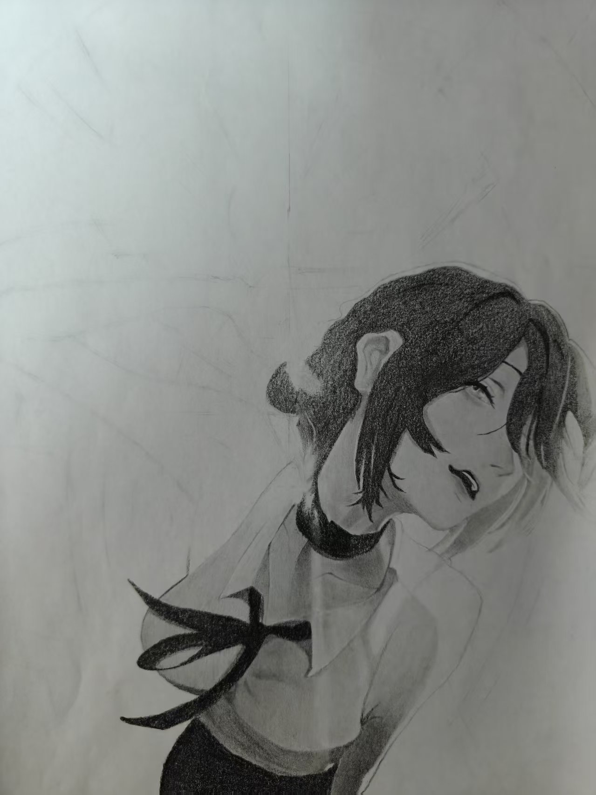
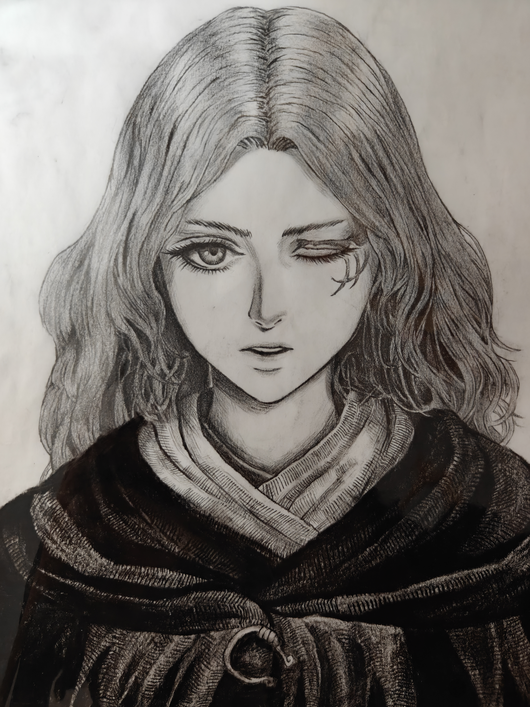
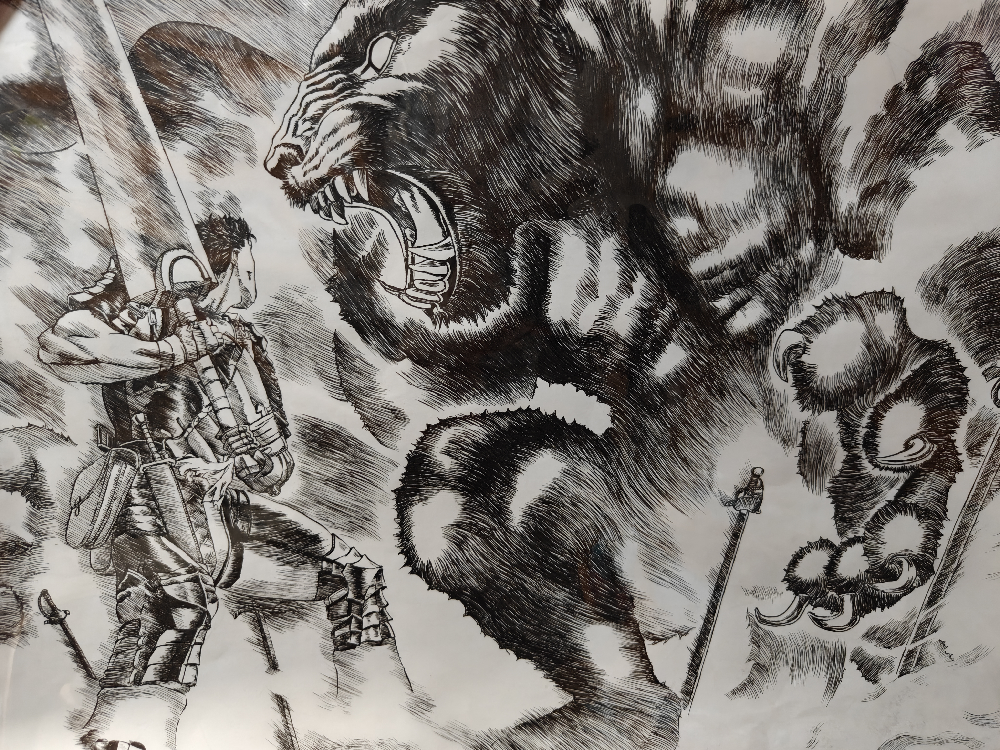

# 选做题：绘画小作品

我是刘昊炎，目前正在学习 C++，也喜欢绘画。编程方面还在学习和积累，这里分享几幅平时的绘画小作品。

## 人物绘画练习（一）

人物半身像，展示人物姿态、头发与衣服的线条和明暗。

[查看原图](drawing-01.jpg)

## 人物绘画练习（二）

人物正面肖像，展示五官、发丝与服装的细节。

[查看原图](drawing-02.jpg)

## 场景绘画练习

人物与猛兽的场景，展示线条疏密、黑白对比和画面构图。

[查看原图](drawing-03.jpg)

---

[返回个人介绍与招新作品](../README.md)
